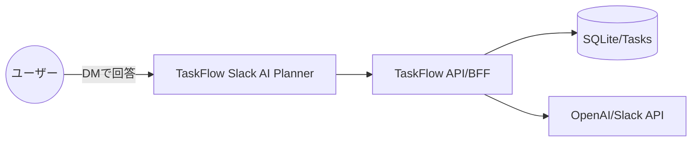
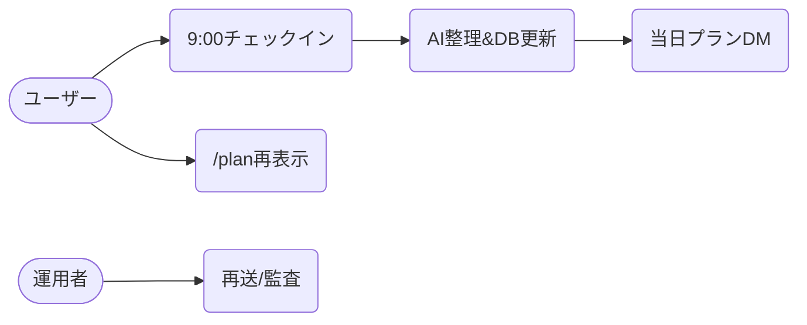
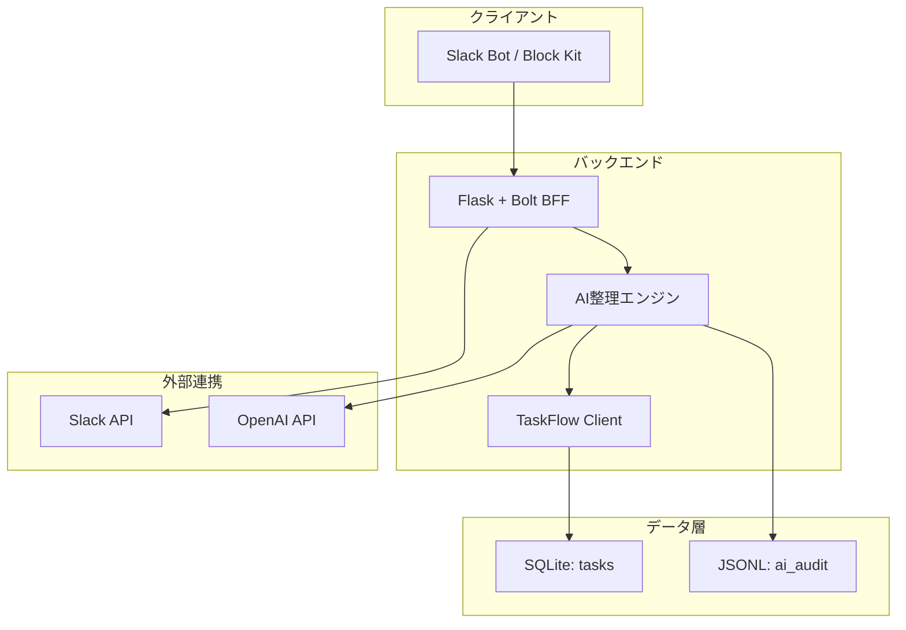
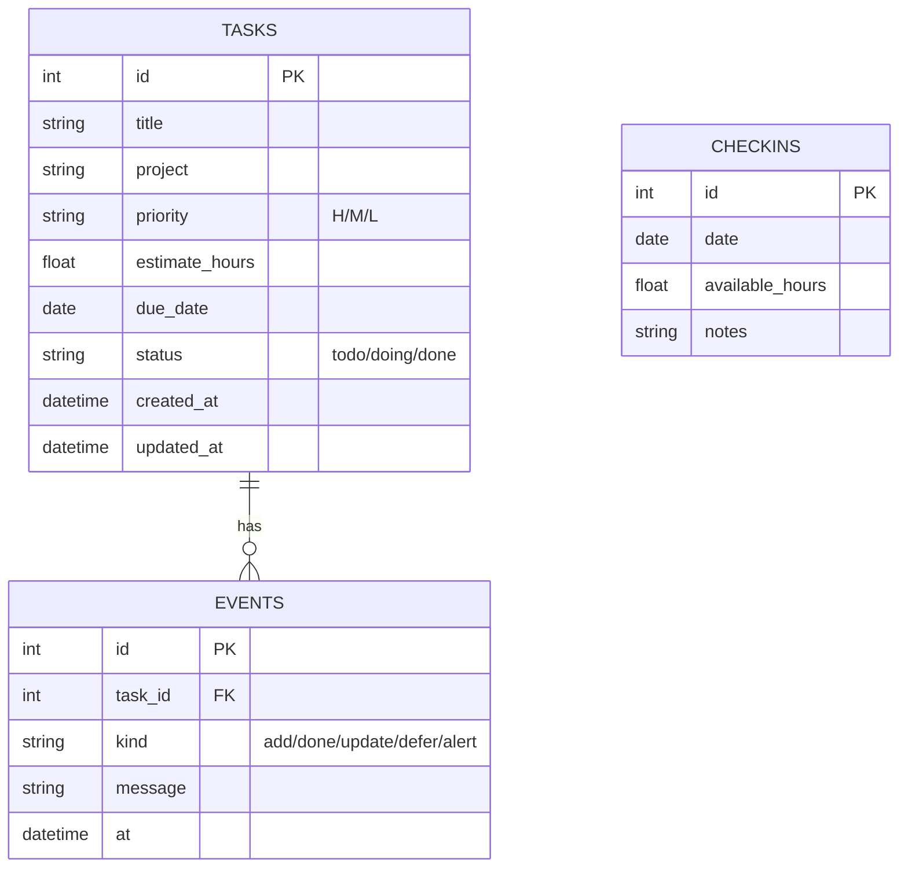
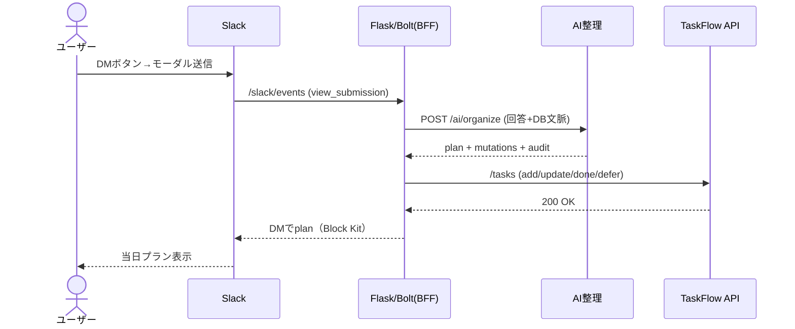
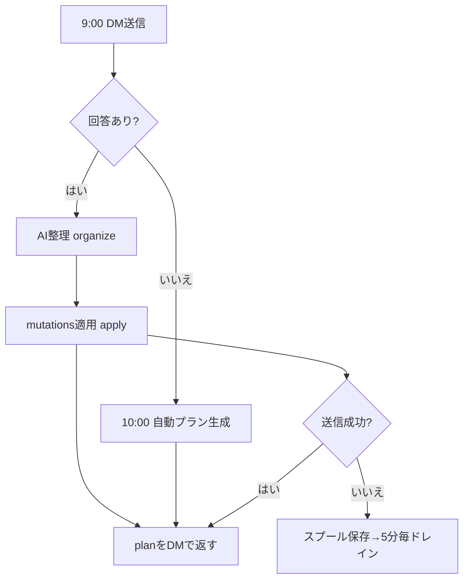
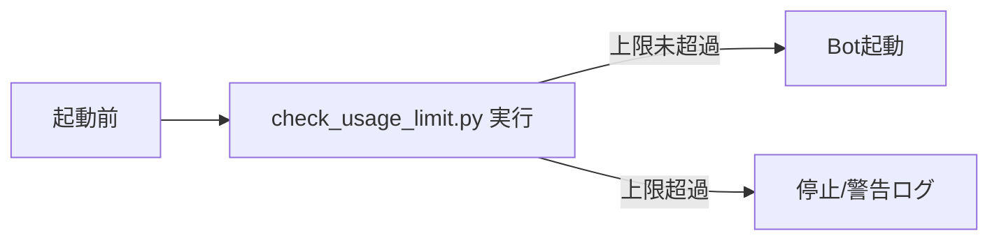

# 1. はじめに（目的と全体像）

- 目的（TaskFlow Slack AI Planner）
  - 毎朝の進捗（Slack DMの回答）とTaskFlow DBのタスク状態をAIで再整理し、現実的な当日プランを自動生成・提示する。

- スコープ
  - 含む: Slack DMボット、AI整理エンジン（抽出/重複統合/優先度調整/スケジュール生成）、TaskFlow API連携、監査ログ、再送/リトライ。
  - 含まない: UIポータルの詳細設計、長期ロードマップ、アカウント管理、チーム配賦/コスト管理。

- 読者想定（個人利用者、チームリーダー/マネージャー、運用管理者）
  - 開発初学者でも流れを理解できるよう、用語は平易に説明。

- 用語集（簡潔）
  - LLM: 大規模言語モデル（例: OpenAI）。自然文を解析し判断・生成するAI。
  - Bolt: Slack公式SDK（Python）。ボット実装に使う。
  - Block Kit: SlackメッセージのUI部品（ボタン/モーダル等）。
  - BFF: Backend for Frontend。クライアント向けに整形するAPI層。
  - 可処分時間: その日使える作業時間（会議等を除く）。

図: 全体像（ユーザー→アプリ→API→DB→外部）

**チェックリスト**
- 目的と範囲が一読で分かる
- 誰向けの文書か明記
- 専門用語に簡潔な注釈がある

# 2. ユーザーストーリーとユースケース

- ペルソナ
  - 個人実務者（IC）: 朝にDMで進捗/可処分時間を回答し、AIの当日プランに従う。
  - 運用管理者: 監査ログと再送状況を見て安定稼働させる。

- ユーザーストーリー（Given/When/Then）
  - S1: Given 朝9時、When ボットからDMが届きモーダルで昨日/今日/可処分時間を送信、Then AIが重複を統合し現実的な当日ブロック計画が返る。
  - S2: Given タイトルが似たタスクが複数ある、When 新規タスクを自然文で書く、Then AIは類似度≥0.8で既存にマージし重複登録を防ぐ。
  - S3: Given 期限48h以内の重要タスク、When 当日の計画に入らない、Then DEADLINE_RISKを警告し代替案が提示される。
  - S4: Given 無応答、When 10時、Then 前回/DB情報から自動プランがDMされる。
  - S5: Given TaskFlow API一時障害、When 送信失敗、Then スプール保存→5分ごとに再送。

- 主要ユースケース（要約表）

| ID | 入力/トリガ | 基本フロー | 終了条件 |
|---|---|---|---|
| UC-01 | 9:00 DM | 回答→/ai/organize→/ai/apply→DM | plan表示・mutations適用完了 |
| UC-02 | /plan | DBから即時プラン生成 | plan表示 |
| UC-03 | 送信失敗 | スプール保存→再送 | 成功で削除 |
| UC-04 | 無応答10:00 | 自動プラン生成→DM | plan表示 |
| UC-05 | 管理トリガ | prompt/drain/plan API | 成功レスポンス |

図: 簡易ユースケース/フロー

**チェックリスト**
- 主要シナリオの抜け漏れなし
- 終了条件が測定可能（plan表示/DB更新/再送成功）

# 3. 機能要件（要件票）

主要機能（Slack DMチェックイン、AI整理、スケジューリング、アラート/リスケ案、DB更新、監査ログ、再送/管理）

| ID | 要件 | 優先度 | 入力/トリガ | 出力 | 完了条件 |
|---|---|---|---|---|---|
| FR-01 | 9:00 DM送信 | Must | スケジューラ | DM（モーダル起動ボタン） | JST 9:00±1分で送信 |
| FR-02 | チェックイン受付 | Must | モーダル送信 | JSON入力（昨日/今日/可処分時間/不可時間） | 200 ACK, 重複送信を無視 |
| FR-03 | AI整理（抽出・重複統合・優先度再評価） | Must | /ai/organize | plan/mutations/dedupe/audit | 類似度≥0.8でmerge、全ブロック/アラートにreason付き |
| FR-04 | 自動スケジューリング | Must | today_hours/不可時間 | ブロック列（0.5–2h） | 合計≤today_hours+15% |
| FR-05 | リスク警告/リスケ案 | Must | 締切/依存情報 | alerts/advice | 48h以内未計画→DEADLINE_RISK出力 |
| FR-06 | DB更新適用 | Must | /ai/apply | add/update/done/defer | 200応答、冪等に適用 |
| FR-07 | 監査ログ出力 | Should | 整理/適用時 | JSONL | 各判断にsource/reason_summary |
| FR-08 | 再送/管理トリガ | Should | 障害/手動 | spool再送/即時prompt/plan | 5分周期で再送、手動実行OK |

**チェックリスト**
- 完了条件が曖昧でない（数値/条件で測定可能）
- 前提（JST、トークン、署名検証等）が明記されている

# 4. 全体アーキテクチャ

- コンポーネントの責務
  - Slack Bot（Client/BFF）
    - /slack/events 受信、モーダル、DM送信、スケジューラ、/ai/* エンドポイントを内包。
  - AI整理サービス（Service）
    - 抽出/重複判定/優先度調整/スケジュール生成、OpenAI（任意）呼び出し。
  - TaskFlowクライアント（Service）
    - /tasks CRUD、（環境によって /v1/* も可）。
  - DB（Data）
    - SQLite（tasks）。概念上は checkins/events も取り扱う。
  - 外部
    - Slack API、OpenAI API（任意）、ngrok経由公開。

- 環境の違い
  - ローカル: SLACK_OFFLINE=1でSlack未接続でも動作（AI API/DB更新のみ）。
  - ステージング/本番: 有効なSlack Bot Token/Signing Secretを設定。ngrokやLBを利用。

図: コンポーネント図

**チェックリスト**
- データ流れが一目で分かる
- 責務の重複がない（BFFとServiceを分離）

# 5. データ設計（スキーマ/ER図）

- テーブル定義（概念）
  - tasks: 既存。タイトル/優先度/見積/期限/状態/作成更新日時。
  - checkins: 日付・可処分時間・自由記述。将来拡張に備えた概念テーブル。
  - events: 変更イベントやAI判断のサマリ（または監査ログに対応）。

- 主なカラム仕様
  - tasks.priority: H/M/L（既定M）
  - tasks.status: todo/doing/done（既定todo）
  - checkins.available_hours: 当日の可処分時間
  - events.kind: add/done/update/defer/alert等

図: ER図

**チェックリスト**
- 必須/一意/外部キーが必要箇所に定義されている
- 命名が一貫していて意味が明確

# 6. API設計（主要エンドポイント）

- 認証/権限
  - Slack→Bot: Slack署名検証（Bolt）。Slash/Modal/Action対応。
  - Bot→TaskFlow: Bearerトークン（TASKFLOW_API_TOKEN）。
  - Bot→OpenAI: OPENAI_API_KEY（任意）。

- バリデーション/エラー
  - 必須フィールドの有無、型（today_hoursはfloat）。400/404/5xxを適切に返す。
  - リトライ方針: 429/5xxはバックオフ、TaskFlow送信失敗はスプール→定期再送。

- 代表エンドポイント例
  - POST /ai/organize（Bot内）
    - 入力: {free_text, today_hours, dialog_entries[], context{tasks[], checkins_recent[], events_recent[]}}
    - 出力: {plan{blocks[], alerts[], advice, total_hours}, mutations{add/update/done/defer}, dedupe[], audit{}}
  - POST /ai/apply（Bot内）
    - 入力: {mutations, reason}
    - 出力: {applied[], errors[]}
  - TaskFlow（例）
    - GET /tasks?status=all, POST /tasks, PATCH /tasks/{id}
  - 運用補助
    - GET / ルート: サービス情報（openai_enabled など）
    - GET/POST /ui: ブラウザから organize を実行する簡易テスター（OpenAI疎通確認用）

図: シーケンス図（9:00→回答→整理→適用→DM）

**チェックリスト**
- 失敗時のステータス・再試行方針が明確
- 入力制約（型/必須）の説明がある

# 7. 業務フロー/処理手順

- 日次フロー
  1) 09:00 JST: DMでチェックイン依頼（ボタン）。
  2) 回答受領→AI整理（抽出/重複/優先度/スケジューリング）。
  3) mutationsをDBへ適用（冪等、部分成功許容）。
  4) planをDM送信。alerts/adviceを添える。
  5) 10:00 JST: 無応答なら自動プランを提示（DB情報のみ）。
  6) 5分毎: スプールドレイン（送信失敗分の再送）。

- 例外
  - Slack/TaskFlow/LLM障害→再送/フォールバック（ヒューリスティック）。
  - 重複判定誤り→updateのみ適用で保守的に運転。

図: フロー図

**チェックリスト**
- 例外/分岐が表現されている
- 自動/手動（管理トリガ）の境界が明確

# 8. 非機能要件

- 性能
  - /ai/organize 応答 < 2秒（ヒューリスティック時）、LLM時 < 8秒（P95）。
  - /ai/apply 適用 < 2秒（10ミューテーションまで）。

- 可用性
  - ビジネス時間帯（8:00–20:00 JST）で 99%。
  - 失敗時はスプールに保存→5分毎に再送。

- セキュリティ
  - Slack署名検証、最小権限（chat:write, im:write, commands）。
  - トークンは環境変数管理、ログに本文を出さない。

- 運用監視
  - JSONL監査ログ（data/ai_audit.jsonl）。
  - ヘルスエンドポイント /healthz。
  - コスト制御: OpenAI費用の上限を `MAX_USD_LIMIT` で管理し、`check_usage_limit.py` を日次実行。
    - 例: 上限超過時はアプリのOpenAI呼び出しを停止（起動ガードとして先に実行）。

**チェックリスト**
- 目標値（SLO）と測定手段が対になっている
- リトライ/フォールバックが明示されている

# 9. 画面設計（主要画面：Slack）

- DMプロンプト
  - テキスト＋「チェックインを入力」ボタン。
- モーダル項目
  - 今日の可処分時間（数値）
  - 昨日やったこと（複数行）
  - 今日やること（複数行）
  - ブロッカー（任意）
  - 不可時間/会議（例: 10:00-11:00）
- バリデーション
  - 可処分時間は数値。空なら0扱い。テキストは最大数千文字まで。
- 返信メッセージ
  - 見出し＋ブロック（時間帯 or 時間数）＋アラート＋アドバイス。

**チェックリスト**
- 必須入力と任意入力の区別がある
- エラー時の案内（再試行/コマンド）がある

# 10. テスト計画と受け入れ基準

- テスト観点
  - 機能: DM→モーダル→organize→apply→planの一連。
  - 回帰: dedupe, 48hルール, OVERLOAD, 0.5–2.0hブロック, 連続2本制限。
  - 負荷: /ai/organize P95 < 2秒（ヒューリスティック）。
  - セキュリティ: 署名検証、トークン非出力。
  - UX: 文言/アラートの分かりやすさ。

- 受け入れ基準（例）
  - 類似度≥0.8で重複統合が発生（mutations.updateに出る）。
  - today_hours超過→OVERLOADアラート（+15%）を出す。
  - 期限≤48h未計画タスク→DEADLINE_RISKアラート。
  - 監査ログに全判断のsource/reason_summaryが記録。

**チェックリスト**
- 合否判定が客観的（数値/条件）
- 主要機能の自動/手動テスト両方が想定されている

# 11. リリース/運用手順

- 構築
  - 依存: `pip install -r slack_bot/requirements.txt`
  - API: `python -m taskflow api --port 8000`
  - コストチェック（任意/推奨）: `python check_usage_limit.py`（上限超過なら停止）
  - Bot: `python -m slack_bot.app`（Slackなしは `SLACK_OFFLINE=1`）

- 設定（主要環境変数）
  - SLACK_BOT_TOKEN, SLACK_SIGNING_SECRET（本番時）
  - TASKFLOW_API_BASE_URL, TASKFLOW_API_TOKEN
  - OPENAI_API_KEY, OPENAI_MODEL（任意）
  - DAILY_USER_IDS, USER_MAP_JSON
  - JST_HOUR/JST_MINUTE, PORT, LOG_LEVEL

- デプロイ/ロールバック
  - プロセス監視（systemd/PM2等）。ログ退避。
  - 失敗時は前バージョンの仮想環境に切替。

- 障害時連絡
  - Slack #ops にアラート（将来拡張）。当面は監査ログ/再送で把握。

図: コスト上限制御フロー（起動ガード）

**チェックリスト**
- 手順が箇条書きで再現可能
- ロールバック/代替手段が用意されている

# 12. リスクと対応策

- 外部API障害（Slack/TaskFlow/LLM）
  - 対応: スプール保存と定期再送、LLM失敗→ヒューリスティックにフォールバック。

- LLM応答揺れ/コスト
  - 対応: JSONフォーマット強制、温度低め、トリミング（最大150タスク）、監査記録。

- 重複判定の誤り
  - 対応: デフォルトは保守的（rename/update）、自動削除はしない。

- タイムゾーン/再起動の重複送信
  - 対応: JST固定、モーダルview_idによる冪等、スケジューラの二重起動ガード。

**チェックリスト**
- 重大リスクに検知/復旧策がある
- フォールバック戦略が具体的

# 付録

- 用語集（拡張）
  - BFF: クライアント専用の薄いAPI層。
  - Guardrail: AIの暴走を防ぐ制約（例: 時間超過不可）。
  - JSONL: 1行1JSONのログ形式（監査で利用）。

- 代表curl例
  - organize: `curl -s http://127.0.0.1:3000/ai/organize -H 'Content-Type: application/json' -d '{"free_text":"新規: 仕様書","today_hours":3,"dialog_entries":[{"text":"昨日: PR #12 完了"}],"context":{"tasks":[]}}'`
  - apply: `curl -s http://127.0.0.1:3000/ai/apply -H 'Content-Type: application/json' -d '{"mutations":{"add":[{"title":"仕様書"}]}}'`
  - 管理トリガ: `curl -s -X POST http://127.0.0.1:3000/admin/trigger -H 'Content-Type: application/json' -d '{"type":"drain"}'`

- 設定テンプレート（例）
  - `.env`（本番はSecret管理）
    - SLACK_BOT_TOKEN=…
    - SLACK_SIGNING_SECRET=…
    - TASKFLOW_API_BASE_URL=http://127.0.0.1:8000  # ローカル（本番は https://…/v1 など）
    - TASKFLOW_API_TOKEN=…
    - OPENAI_API_KEY=…
    - OPENAI_MODEL=gpt-4o-mini
    - MAX_USD_LIMIT=20.0
    - DAILY_USER_IDS=UXXXX,UYYYY
    - JST_HOUR=9, JST_MINUTE=0

- 参考リンク
  - Slack Bolt（Python）: https://slack.dev/bolt-python/
  - OpenAI SDK（Python）: https://github.com/openai/openai-python
  - Mermaid: https://mermaid.js.org

--- 

# 15. 現時点の課題と改善方針（メモ）

ユーザー検証から見えた課題と、それに対する具体的な改善案を整理します。順次バックログ化して実装します。

- 課題: ボットから送られてくる「本日のプラン」が分かりにくい
  - 改善案:
    - Block Kit をリッチ化（番号付き・合計時間・凡例・優先度/期限のバッジ表示）
    - 各ブロックにタスクID/プロジェクト/期限を明記、スコア（S_total）と簡単な理由を1行で表示
    - 「詳細を見る」ボタン（デッシュボードURL）を併記

- 課題: 今のタスクの全体量が分からない / 期限も把握しづらい
  - 改善案:
    - ダッシュボードの拡張（tasksテーブルの一覧＋フィルタ：期限順/優先度順/プロジェクト）
    - Slackの `/tasks` コマンドで要約（総数/TODO/期限<=48h/今週）を即時表示
    - プランDMの冒頭に「総タスク数/本日範囲/期限警告件数」をサマリ表示

- 課題: ボット以外で全体タスクを見たい
  - 改善案:
    - 既存の `app/dashboard.py` を強化（優先度・期限・スコア・警告の可視化、ドリルダウン）
    - Bot内の簡易Web（Flask）に `/ui/tasks` を追加し、一覧とフィルタを提供（SSEは将来）

- 課題: タスクの優先順位を可視化したい
  - 改善案:
    - AI scoring（S_base/S_adj/S_total）をダッシュボードで棒グラフ/ヒートマップ化
    - Slackの `/plan` 応答に上位3件のスコアと簡単な理由（reason_summary）を併記

- 課題: 学習時間（勉強/自己研鑽）の記録を残したい
  - 改善案:
    - checkins（可処分時間）に加えて、学習時間の専用フィールド/テーブルを追加（`study_logs`）
    - Slackのショートコマンド `/log Nh 学習テーマ` で学習時間を記録 → ダッシュボードで週次推移表示

- 課題: `/plan` はボットへ送るイメージだが、現状 DM へのメッセージ送信がオフ
  - 改善案:
    - Slack App 設定で「Allow users to send DMs to this app」を有効化
    - 必要に応じて App Home を有効化して Onboarding と利用説明を配置
    - Event Subscriptions で `app_mention`, `message.im` を購読し、DMの自然文トリガでも整理を実行

- 課題: 随時、今のタスク状況を送ったら全体から整理されるようにしたい
  - 改善案:
    - スラッシュコマンド `/organize` を追加し、フリーテキストを受けて `organize` → `apply` → プラン返信
    - メッセージアクション「整理する」を追加（選択テキスト → モーダル確認 → 実行）
    - DMの通常メッセージでもキーワード `整理`/`organize` で発火（`message.im` 購読時）

実装メモ（優先度案）
- Must: プランのBlock Kit改善、ダッシュボードの期限/優先度可視化、`/tasks` サマリ
- Should: `/organize` 追加、App Home、`app_mention`/`message.im` 対応
- Could: 学習ログ `/log`、スコア可視化、理由の説明強化、SSEによるライブ更新

セキュリティ/運用上の留意点
- Event Subscriptions 有効化時は署名検証とレートリミット対策（ACK先行）を徹底
- 学習ログ等の個人情報を扱う場合は保管期間/匿名化ポリシーを定義
- ダッシュボード公開範囲（ローカル/社内VPN/認証つき）を決める

**チェックリスト**
- プラン表示が「何を/いつ/なぜ」が一目で分かる
- 全体タスク/期限/優先度を1画面で俯瞰できる
- DM/コマンド/アクションのいずれからでも整理が実行できる
- 新しいデータ（学習時間等）の保護と可視化方針が決まっている
