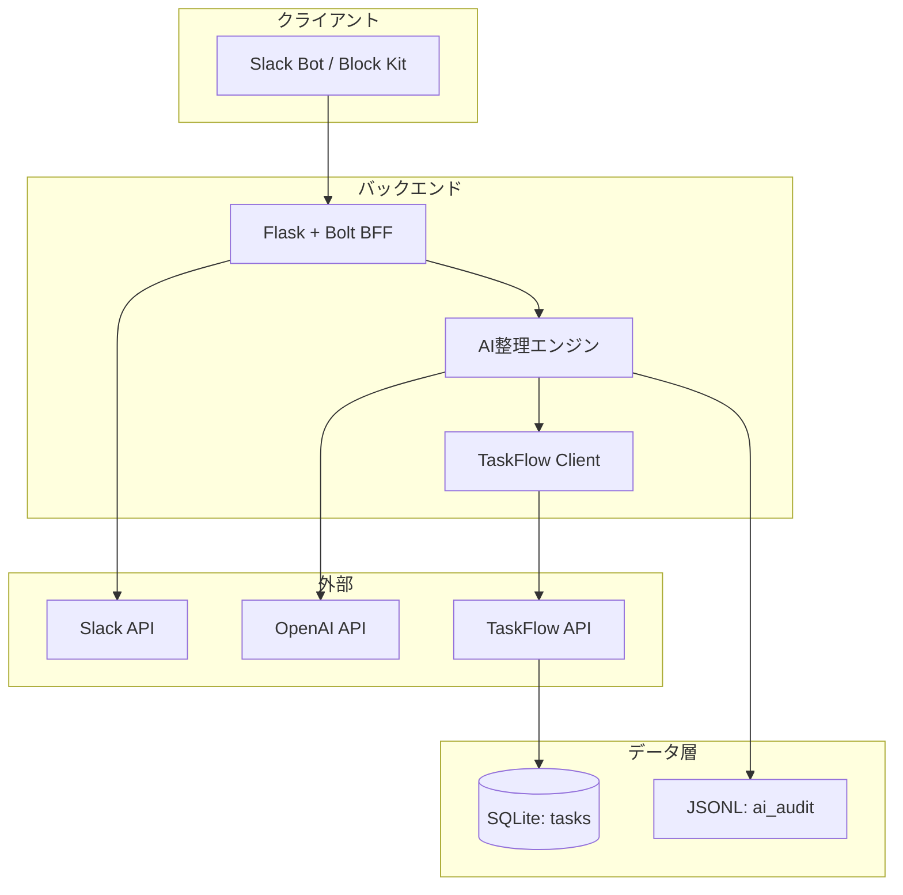

# アーキテクチャ（インデックス／サマリ）

この文書は設計ドキュメントの入口（インデックス）と要約を提供します。詳細は分割された各ドキュメントを参照してください。

- 基本設計: docs/BASIC_DESIGN.md
- 詳細設計: docs/DETAIL_DESIGN.md
- 運用手順: docs/OPERATIONS.md
- 改善計画: docs/ROADMAP.md

## エグゼクティブサマリ
- 目的: SlackのチェックインとTaskFlowのDBを材料に、AIが当日プランを自動生成しDMする。
- スコープ: Slackボット（Bolt/Flask）、AI整理（ヒューリスティック/LLM）、TaskFlow API連携、監査/再送。
- 非機能ハイライト: organize<2s（ヒューリスティック）、LLM時<8s（P95）、業務時間帯の安定動作、最小権限。

## 全体アーキテクチャ（概観）

## 読み方（役割別の導線）
- 要件/ユースケース/非機能/概念: docs/BASIC_DESIGN.md
- API仕様/内部アルゴリズム/詳細シーケンス/Block構成: docs/DETAIL_DESIGN.md
- セットアップ/Slack設定/ngrok/.env/起動/運用: docs/OPERATIONS.md
- 課題と計画（Next/中長期）: docs/ROADMAP.md

## 変更の所在
- 改善や差分の履歴は docs/ROADMAP.md を参照。API・図の詳細更新は docs/DETAIL_DESIGN.md に集約。

