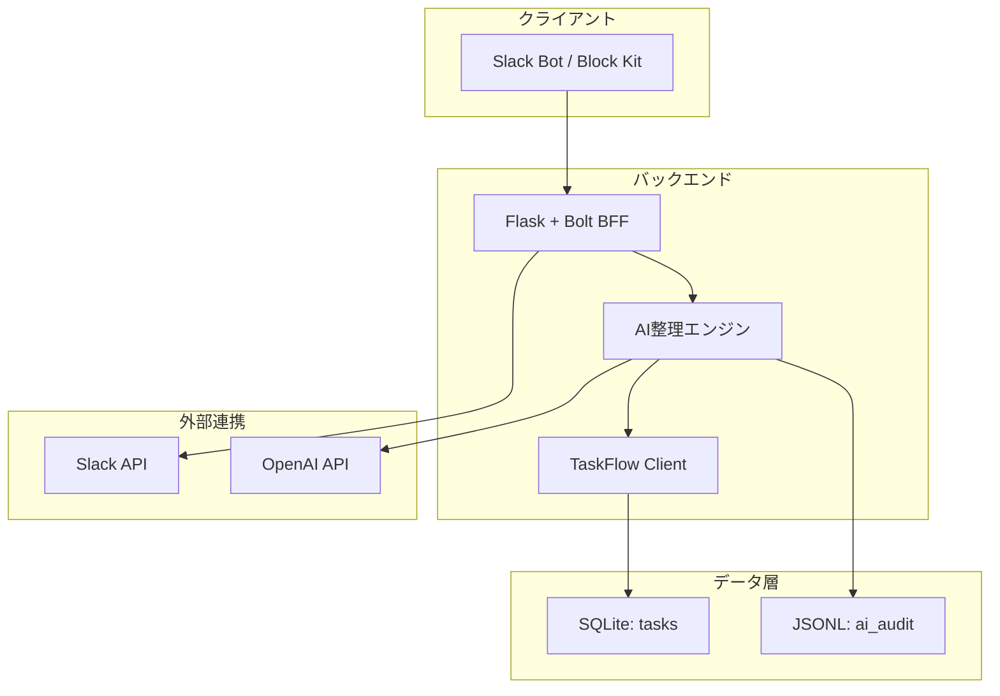
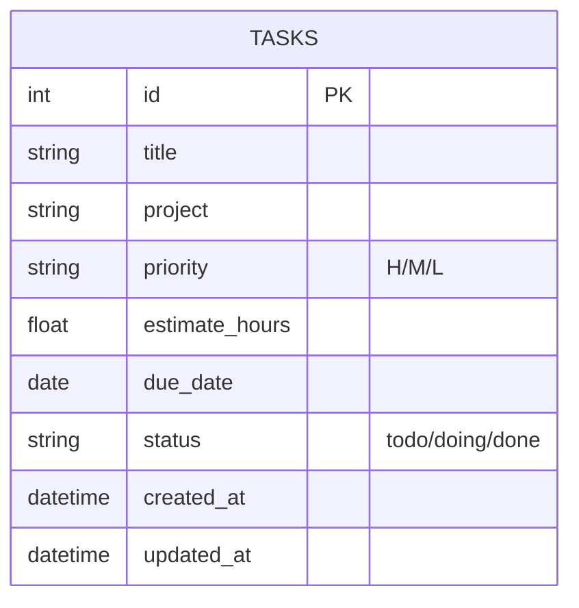
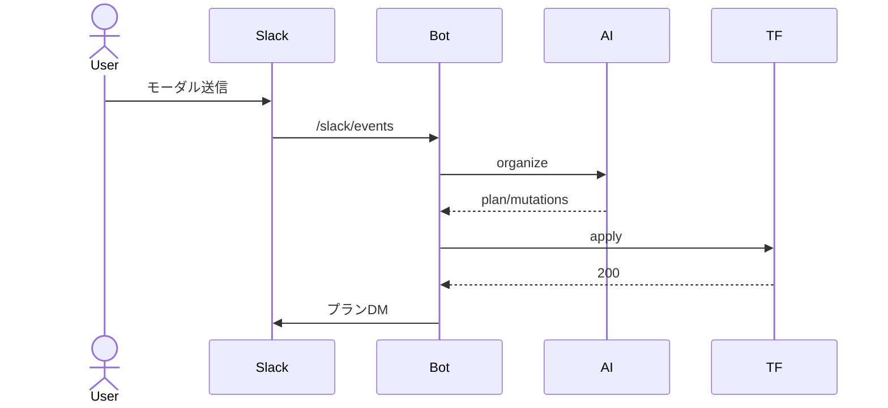
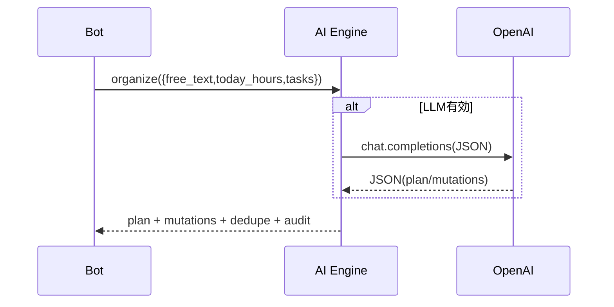
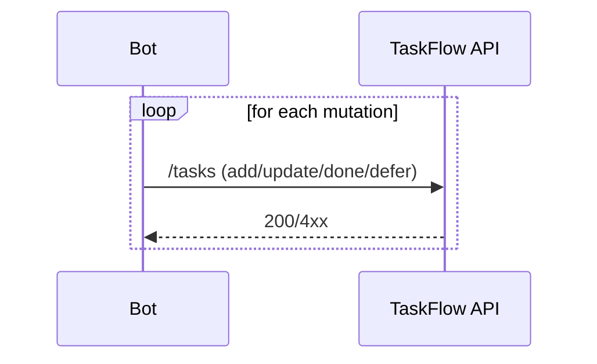
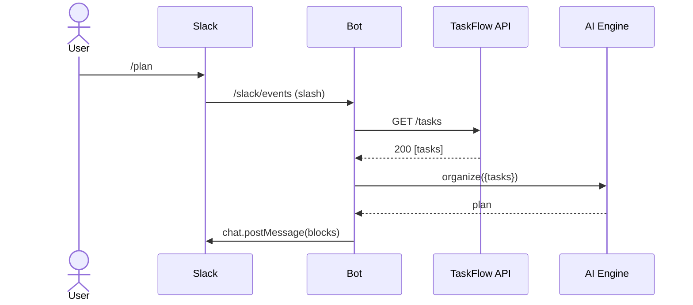
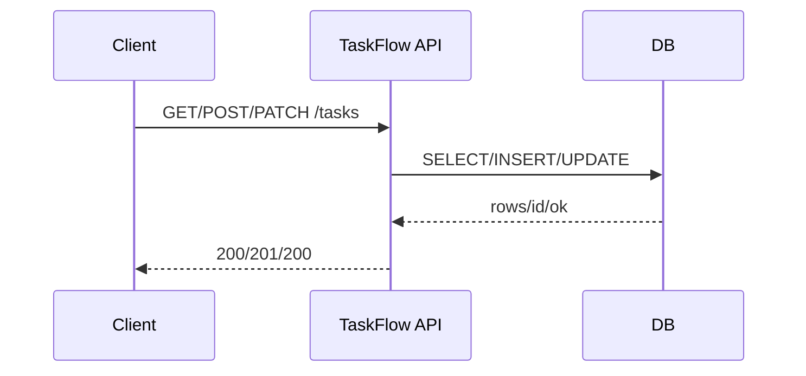

# 基本設計（BASIC DESIGN）

目的・スコープ
- 目的: 毎朝のチェックインとTaskFlowのDBを元に、現実的な当日プランを自動生成してSlackで提示する。
- スコープ: Slackボット、AI整理、TaskFlow API連携、監査、再送。アカウント管理やUIポータル詳細は除外。

ユーザーストーリー（抜粋）
- 9:00にDMが届き、モーダルで入力すると、重複が整理された当日プランが戻る。
- 期限48h以内の重要タスクが未計画ならアラートが出る。
- 無応答なら10:00に自動プランを送る。失敗はスプールされ再送。

主要ユースケース（要約）
- UC-01: 9:00チェックイン → organize → apply → プランDM
- UC-02: `/plan` コマンド → 現状から即時プランDM
- UC-03: 送信失敗 → スプール再送

全体アーキテクチャ（概念）

概念データモデル（ER 概念）

非機能要件（概要）
- 性能: organize<2s（ヒューリスティック）, LLM時<8s（P95）/ apply<2s（<=10件）。
- 可用性: 8:00–20:00 JSTで99%。失敗はスプール→5分間隔で再送。
- セキュリティ: Slack署名検証、最小権限（chat:write, im:write, commands）。

業務フロー（高レベル）

画面設計（Slack 概要）
- DMプロンプト（ボタン）、チェックインモーダル（可処分時間/昨日/今日/ブロッカー/不可）、
- プランDM（サマリ、全体タスク、期限切れ、今日のタスク、アドバイス、アラート、詳細ボタン）。

チェックイン（v2）構想（概要）
- 目的: 「その場で既存タスクの進捗/期限を編集」＋「新規タスクを追加」できるようにする。
- 内容:
  - 上位Nタスク（期限近い/doing/H優先）をモーダルに表示し、各行で状態/期日を入力可能に。
  - 「新規タスク追加」セクションでタイトル/期限/優先/見積を複数件入力可能に。
  - 送信後は organize にかける前段で mutations化し、プレビュー→適用（または即時適用）。
  - 自由記述も併用可（抽出/重複統合の補助）。
  - 詳細は docs/DETAIL_DESIGN.md の「Check-in Modal v2」を参照。

APIごとのシーケンス（概要）

1) organize（プラン生成）

2) apply（差分適用）

3) /slack/events（/plan）

4) TaskFlow /tasks（一覧/作成/更新）

