# 詳細設計（DETAIL DESIGN）

この文書は、API仕様・内部アルゴリズム・メッセージ設計・スケジューラの詳細、ならびにクラス/メソッド粒度のシーケンス図を提供します。

1. API仕様（Bot内）
- POST /ai/organize
  - 入力: `{ free_text, today_hours, dialog_entries[], context{ tasks[], checkins_recent[], events_recent[] } }`
  - 出力: `{ plan{ total_hours, blocks[start,end,hours,title,reason_summary,...], alerts, advice }, mutations{ add/update/done/defer }, dedupe[], audit{} }`
  - 実装: `slack_bot.ai_engine.organize(payload)` →（必要時）`slack_bot.llm_client.organize_with_openai`

- POST /ai/apply
  - 入力: `{ mutations{ add/update/done/defer }, reason }`
  - 出力: `{ applied[], errors[] }`
  - 実装: `slack_bot.ai_engine.apply_mutations(mutations, apply_fn)` で `apply_fn` 経由で `slack_bot.taskflow_client.TaskFlowClient` の CRUD を呼ぶ

- POST /admin/trigger
  - 入力: `{type:"prompt"|"drain"|"plan", user?}` / Header: `X-Admin-Token`
  - 実装: `slack_bot.app.admin_trigger`

2. API仕様（TaskFlow）
- GET /tasks, POST /tasks, GET/PATCH/DELETE /tasks/{id}
  - 実装（Flask）: `src/taskflow/api/routes.py` → サービス層 `src/taskflow/services/tasks.py` → ORM `src/taskflow/db/models.py`

3. アルゴリズム（organize 概要）
- 正規化: NFKC → 小文字化 → 記号除去 → トークン化
- 重複判定: Jaccard類似度（merge≧0.8、review[0.7–0.8)）
- 優先度スコア: priority(H/M/L) + 期限の切迫度 + 連続・ブロッカー調整（±2以内）
- スケジューリング: 09:00開始、0.5–2.0hで配置、不可時間を回避、連続2本まで、today_hours+15%以内

4. メッセージ設計（Block Kit 要点）
- `slack_bot.block_kit.plan_blocks_from_api(plan, tasks)` がDMを組み立てる。
- セクション: サマリ、全体タスク、期限切れ、今日のタスク（開始/終了 or 所要時間、期限、理由）、アドバイス、アラート、（任意）詳細ボタン。

5. スケジューラ/ジョブ
- 09:00 DMプロンプト、10:00 自動プラン、5分おきスプール再送。
- 実装: `slack_bot.app._start_scheduler()`（APScheduler）。

6. 詳細シーケンス図（クラス/メソッド粒度）

6.1 チェックイン→プレビュー→適用
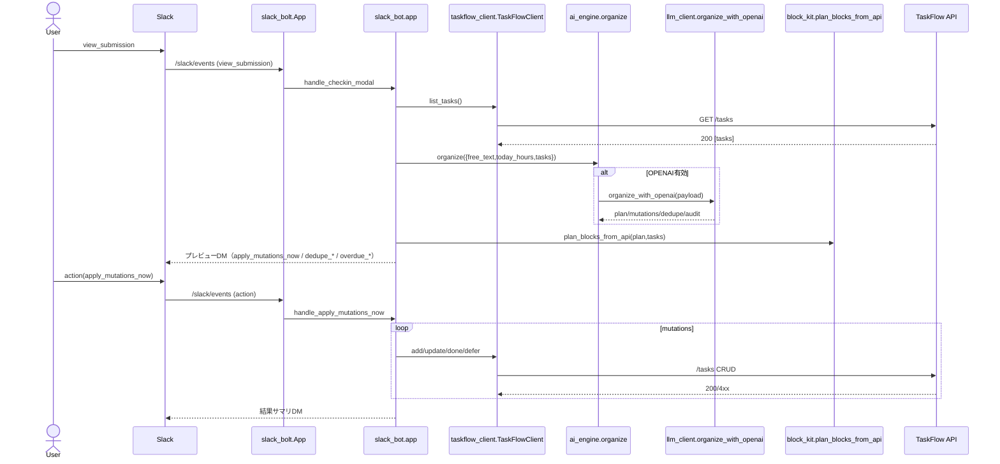

6.2 `/plan` 実行
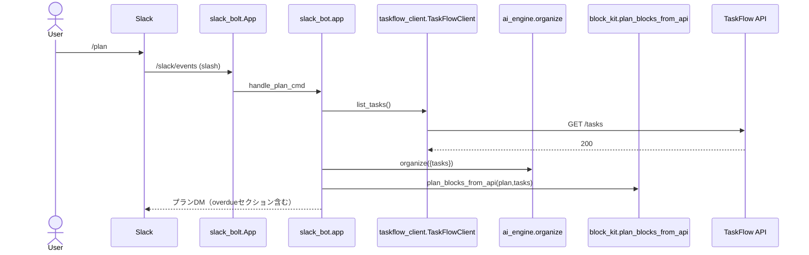

6.3 10:00 自動プラン
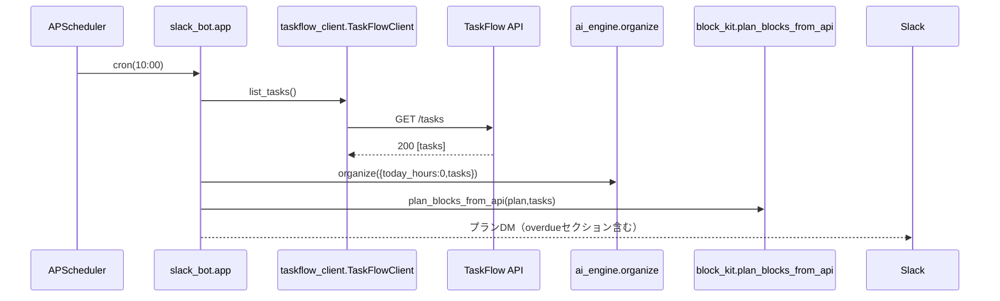

6.4 Bot内API（/ai/organize）
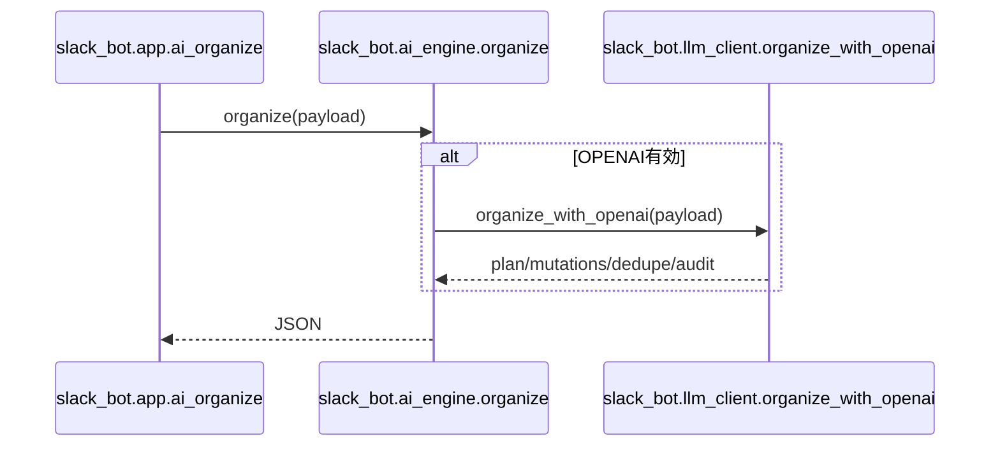

6.5 Bot内API（/ai/apply）
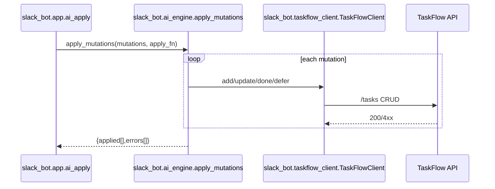

6.6 Slackアクション: apply_mutations_now
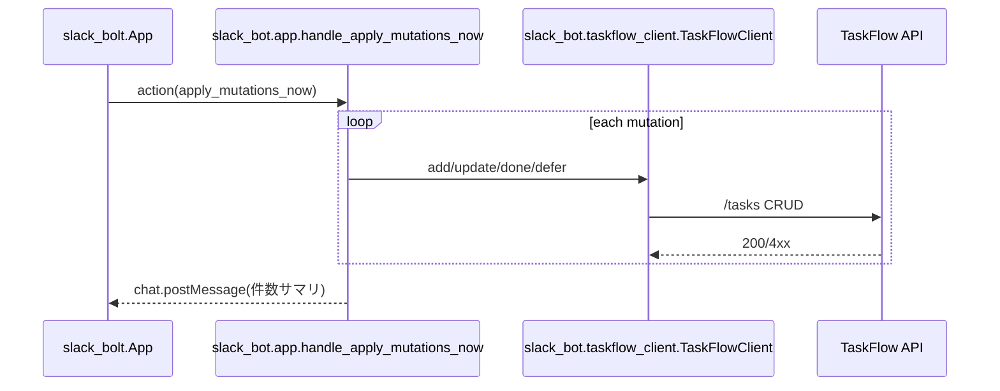

6.7 Slackアクション: overdue_done/overdue_reschedule
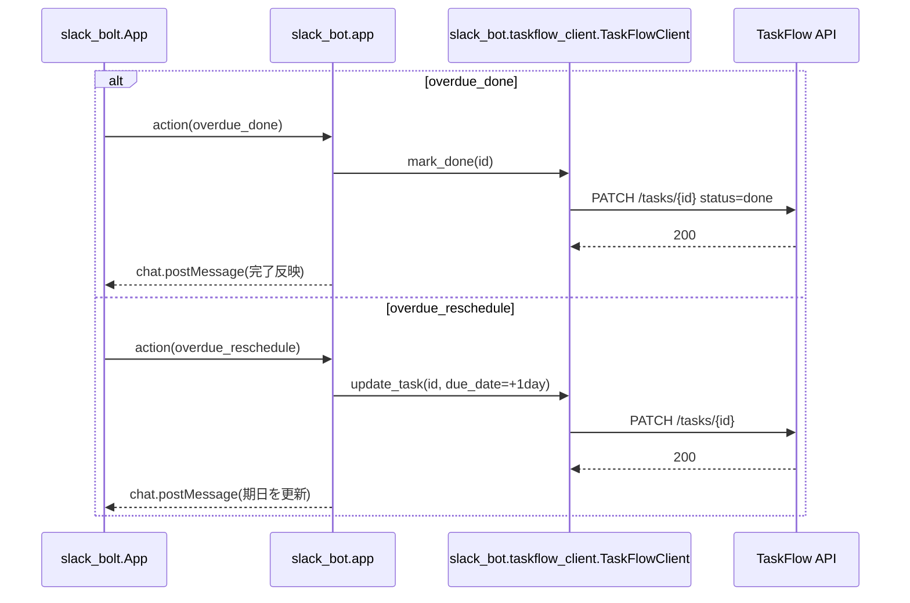

6.8 TaskFlow API: /tasks
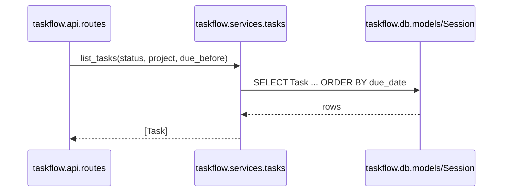

6.9 TaskFlow API: POST /tasks
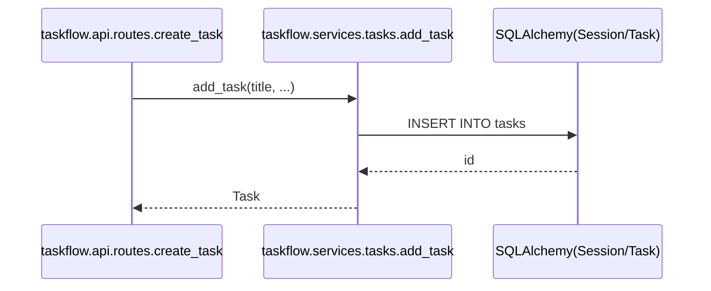

6.10 TaskFlow API: PATCH /tasks/{id}
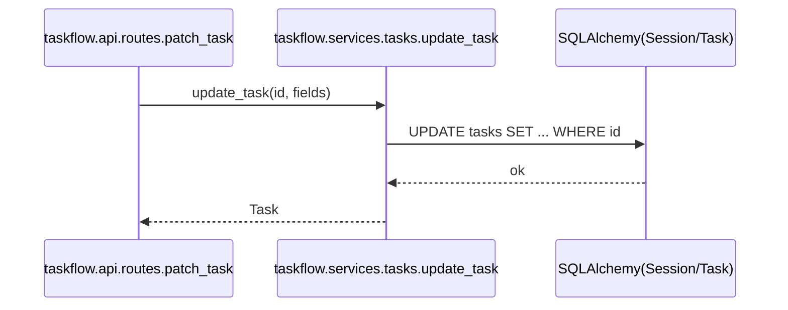

6.11 Slack: /slack/events（/plan）
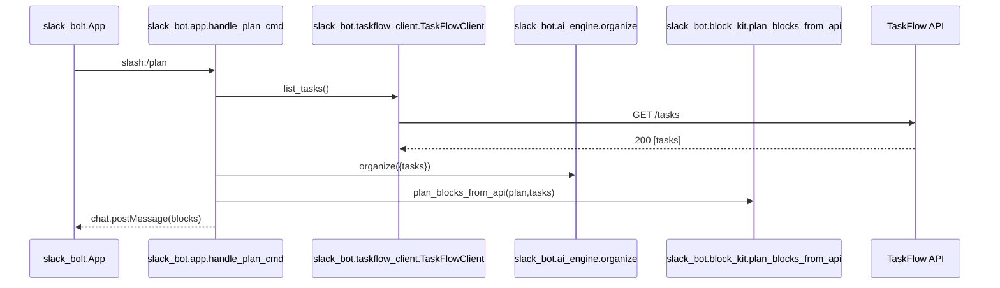

7. データスキーマ詳細（tasks）
- priority: 'H'|'M'|'L'（CHECK制約）。
- status: 'todo'|'doing'|'done'（CHECK制約）。
- due_date: ISO日付（NULL可）。

8. バリデーションとエラー
- /ai/organize: today_hoursは数値。必須フィールド欠落は400/422相当。
- /ai/apply: 未知のmutationはエラー配列に格納しつつ処理継続。

9. Check-in Modal v2（タスク進捗入力 + 新規追加）

目的
- 現状の自由記述中心の入力から、既存タスクの進捗/状態/期日を直接編集できるUIへ拡張する。同時に新規タスクを追加可能にする。

構成（Block Kit 概要）
- セクションA: 今日の可処分時間（数値）
- セクションB: 既存タスク（上位N件）
  - 表示対象の例: 期限が近い順、doing優先、H優先、最大N=10
  - 各行: タイトル（表示のみ）/ 状態（todo/doing/done セレクト）/ 期日（plain_text_input YYYY-MM-DD）/ （任意）メモ
- セクションC: 新規タスク追加（可変個数、最大M=5）
  - 各行: タイトル（text）/ 期限（text YYYY-MM-DD）/ 優先（H/M/L セレクト）/ 見積（数値）
- セクションD: 自由記述（任意。抽出/重複統合の補助として維持）

データ化（送信時）
- `checkin_v2.progress[]`: `{id, status?, due_date?, note?}`… 既存タスクの更新意図
- `checkin_v2.add[]`: `{title, priority?, estimate_hours?, due_date?}`… 新規追加
- `today_hours`: 数値
- `free_text`: 任意

適用フロー
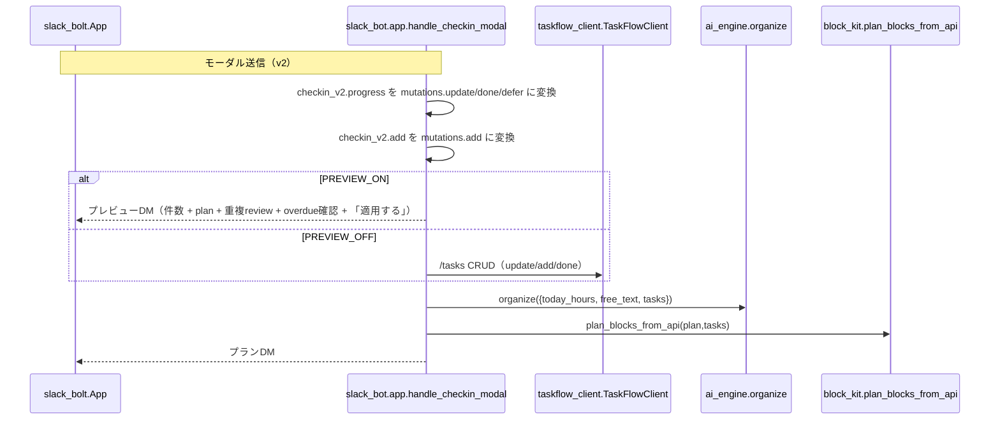

備考
- タスク数が多い場合は上位N件に絞る。N/M は環境変数で調整可能にする。
- 期日入力は ISO（YYYY-MM-DD）。不正値は無視/警告（プレビューに理由を表示）。
- 既存の自由記述の抽出（新規/完了/延期）は v2結果とマージし、重複/競合は v2入力を優先。
